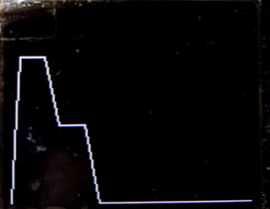

# bode_mockup
Small mock-up of graphical functions for EQ project using an off-the-shelf TFT display shield and an MSP430F5529 microcontroller.

## Explanation of our screen display idea

A C code was made attached with this handout to paint the 6 bands required for our design. The code segments with their on-screen results for what would be our prototype display is shown below. A time sequence of different gain levels was made for a 6 band display to be illustrated to the user as follows:

Initialize all bands to 0

Raise first band to 50%

Raise first band to 75%

Raise second band to 40%

Raise third band to 90%

Raise fifth band to 50%

Raise sixth band to 75%

And finally, lower fifth band to 10%

